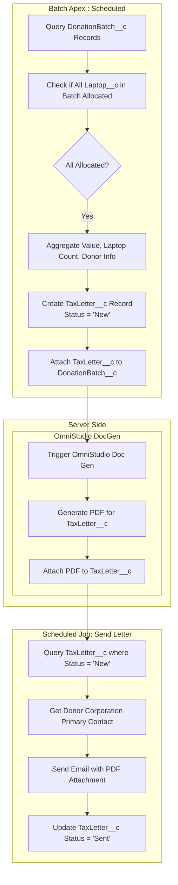

```mermaid
flowchart TD
  subgraph AllocationCheck["Batch Apex : Scheduled"]
    A1[Query DonationBatch__c Records]
    A2[Check if All Laptop__c in Batch Allocated]
    A3{All Allocated?}
    A4[Aggregate Value, Laptop Count, Donor Info]
    A5[Create TaxLetter__c Record<br/>Status = 'New']
    A6[Attach TaxLetter__c to DonationBatch__c]
  end
subgraph ScreenFlow["Server Side"]
    DocGen
end
  subgraph DocGen["OmniStudio DocGen"]
    D1[Trigger OmniStudio Doc Gen]
    D2[Generate PDF for TaxLetter__c]
    D3[Attach PDF to TaxLetter__c]
  end

  subgraph EmailJob["Scheduled Job: Send Letter"]
    E1[Query TaxLetter__c where Status = 'New']
    E2[Get Donor Corporation Primary Contact]
    E3[Send Email with PDF Attachment]
    E4[Update TaxLetter__c Status = 'Sent']
  end

  A1 --> A2 --> A3
  A3 -- Yes --> A4 --> A5 --> A6 --> D1
  D1 --> D2 --> D3 --> E1
  E1 --> E2 --> E3 --> E4
```