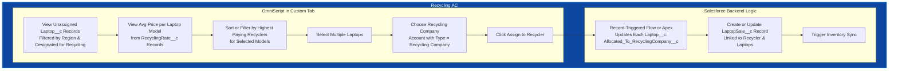

```mermaid
flowchart TD
    subgraph Recycling_AC_Performs["Recycling AC"]
        style Recycling_AC_Performs fill:#0d47a1,stroke:#1976d2,stroke-width:2px,color:#fff
        subgraph Recycling_AC_Tab["OmniScript in Custom Tab"]
            UI1[View Unassigned Laptop__c Records<br/>Filtered by Region & Designated for Recycling]
            UI1A[View Avg Price per Laptop Model<br/>from RecyclingRate__c Records]
            UI1B[Sort or Filter by Highest Paying Recyclers<br/>for Selected Models]
            UI2[Select Multiple Laptops]
            UI3[Choose Recycling Company<br/>Account with Type = Recycling Company]
            UI4[Click Assign to Recycler]
        end

        subgraph Salesforce_Backend["Salesforce Backend Logic"]
            FLOW1[Record-Triggered Flow or Apex<br/>Updates Each Laptop__c:<br/>Allocated_To_RecyclingCompany__c]
            FLOW2[Create or Update LaptopSale__c Record<br/>Linked to Recycler & Laptops]
            INV1[Trigger Inventory Sync]
        end

        UI1 --> UI1A --> UI1B --> UI2 --> UI3 --> UI4 --> FLOW1 --> FLOW2 --> INV1
    end
```