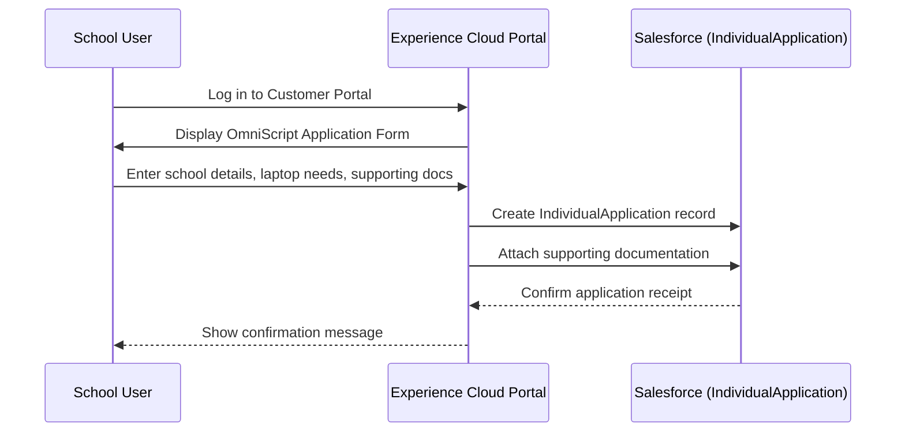
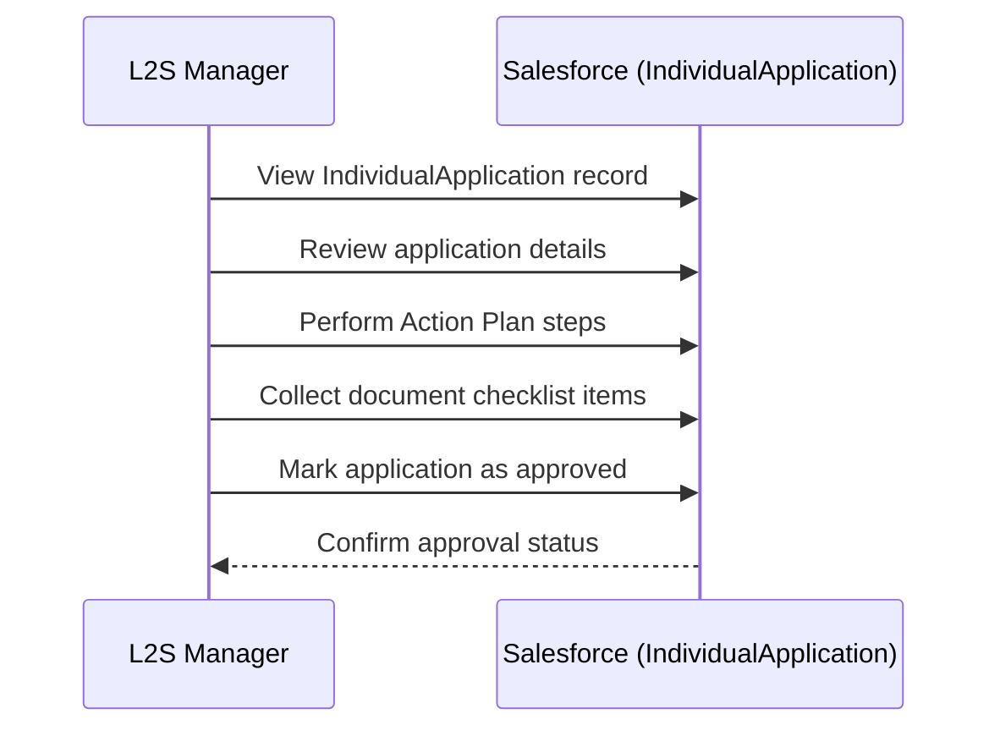
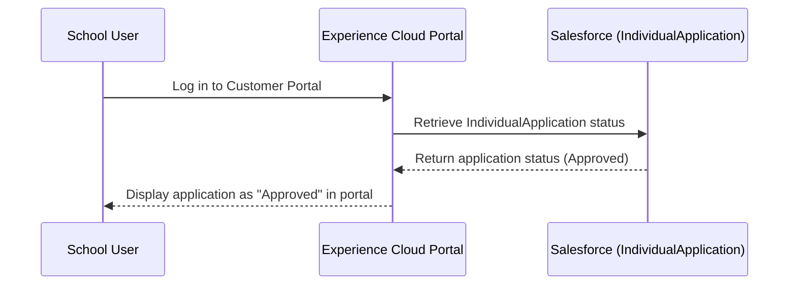

```mermaid
sequenceDiagram
    participant School as School User
    participant Portal as Experience Cloud Portal
    participant SF as Salesforce (IndividualApplication)

    School->>Portal: Log in to Customer Portal
    Portal->>School: Display OmniScript Application Form
    School->>Portal: Enter school details, laptop needs, supporting docs
    Portal->>SF: Create IndividualApplication record
    Portal->>SF: Attach supporting documentation
    SF-->>Portal: Confirm application receipt
    Portal-->>School: Show confirmation message
```

```mermaid
sequenceDiagram
    participant Manager as L2S Manager
    participant SF as Salesforce (IndividualApplication)

    Manager->>SF: View IndividualApplication record
    Manager->>SF: Review application details
    Manager->>SF: Perform Action Plan steps
    Manager->>SF: Collect document checklist items
    Manager->>SF: Mark application as approved
    SF-->>Manager: Confirm approval status
```

```mermaid
sequenceDiagram
    participant School as School User
    participant Portal as Experience Cloud Portal
    participant SF as Salesforce (IndividualApplication)

    School->>Portal: Log in to Customer Portal
    Portal->>SF: Retrieve IndividualApplication status
    SF-->>Portal: Return application status (Approved)
    Portal-->>School: Display application as "Approved" in portal
```