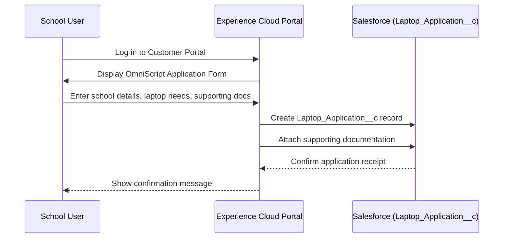

```mermaid
sequenceDiagram
    participant School as School User
    participant Portal as Experience Cloud Portal
    participant SF as Salesforce (Laptop_Application__c)

    School->>Portal: Log in to Customer Portal
    Portal->>School: Display OmniScript Application Form
    School->>Portal: Enter school details, laptop needs, supporting docs
    Portal->>SF: Create Laptop_Application__c record
    Portal->>SF: Attach supporting documentation
    SF-->>Portal: Confirm application receipt
    Portal-->>School: Show confirmation message
```