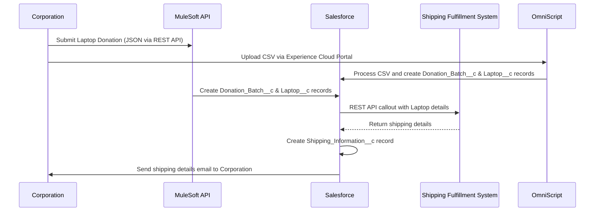

## Step 2: Automate Corporate Laptop Donation Process

### Automated Flow Description

1. **Corporation** initiates a donation either by:
    - Submitting a JSON payload via a REST API to the **MuleSoft API**, or
    - Uploading a CSV file through an **OmniScript** form in the Experience Cloud portal.
2. **MuleSoft API** receives the JSON payload and triggers creation of `Donation_Batch__c` and related `Laptop__c` records in **Salesforce**.
3. Alternatively, the **OmniScript** processes the uploaded CSV and creates the corresponding records in **Salesforce**.
4. Upon successful creation, **Salesforce** makes a REST API callout to the **Shipping Fulfillment System** with shipping details.
5. The **Shipping Fulfillment System** responds with shipping information, which is saved as a `Shipping_Information__c` record in **Salesforce**.
6. **Salesforce** automatically sends an email to the **Corporation** with shipping instructions, enabling shipment to an L2S hub.