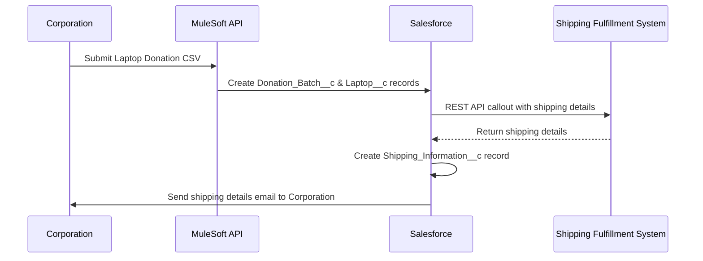

## Step 2: Automate Corporate Laptop Donation Process

### Automated Flow Description

1. **Corporation** initiates donation by uploading a CSV via API or OmniScript (Experience Cloud Site).
2. **MuleSoft API** receives the CSV and triggers creation of `Donation_Batch__c` and related `Laptop__c` records in **Salesforce**.
3. Upon successful creation, **Salesforce** makes a REST API callout to the **Shipping Fulfillment System** with shipping details.
4. The **Shipping Fulfillment System** responds with shipping information, which is saved as a `Shipping_Information__c` record in **Salesforce**.
5. **Salesforce** automatically sends an email to the **Corporation** with shipping instructions, enabling shipment to an L2S hub.