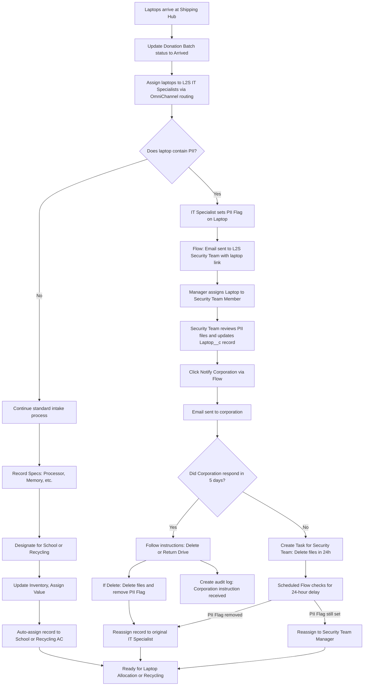

# Step 3: Laptop Intake Process Automation

**Key Automation Points:**
- Status and assignment updates are automated on arrival.
- PII_Flag triggers email and assignment flows.
- Corporation notification is automated
- Task creation and scheduled flow handle escalation if no response.
- Record reassignment is automated after PII is cleared.