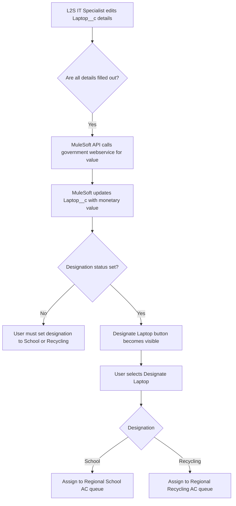

## Step 5: Automating Laptop Monetary Value and Assignment

### Steps to Automate
- L2S IT Specialists complete the donation intake process by adding details to the laptop records (manufacture date, processor type, memory, hard drive capacity).
- Laptops are designated for schools or recycling based on these details.
- Laptops for schools are assigned a monetary value using a government estimating web service.
- Laptop records are assigned to School ACs or Recycling ACs based on region and current workload.

**Notes:**
- Assignment to Users from queues is automated via OmniChannel based on region and capacity.