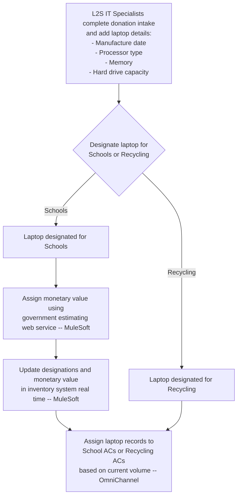

```mermaid
flowchart TD
    A[L2S IT Specialists complete donation intake<br>and add laptop details:<br>- Manufacture date<br>- Processor type<br>- Memory<br>- Hard drive capacity]
    B{Designate laptop for<br>Schools or Recycling}
    C[Laptop designated for Schools]
    D[Laptop designated for Recycling]
    E[Assign monetary value using<br>government estimating web service -- MuleSoft]
    F[Update designations and monetary value<br>in inventory system real time -- MuleSoft]
    G[Assign laptop records to<br>School ACs or Recycling ACs<br>based on current volume -- OmniChannel]

    A --> B
    B -- Schools --> C
    B -- Recycling --> D
    C --> E
    E --> F
    F --> G
    D --> G
```