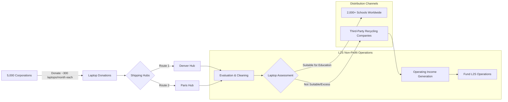

```mermaid
flowchart LR
    A[5,000 Corporations] -->|Donate ~300 laptops/month each| B[Laptop Donations]
    B --> C{Shipping Hubs}
    C -->|Route 1| D[Denver Hub]
    C -->|Route 2| E[Paris Hub]
    
    D --> F[Evaluation & Cleaning]
    E --> F
    
    F --> G{Laptop Assessment}
    G -->|Suitable for Education| H[2,000+ Schools Worldwide]
    G -->|Not Suitable/Excess| I[Third-Party Recycling Companies]
    
    I --> J[Operating Income Generation]
    J --> K[Fund L2S Operations]
    
    subgraph "L2S Non-Profit Operations"
        F
        G
        J
        K
    end
    
    subgraph "Distribution Channels"
        H
        I
    end
```