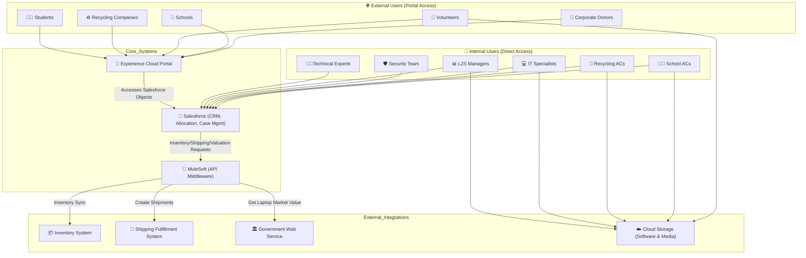

Entities that have Portal Access specified should access Salesforce through an Experience Cloud Portal.

```mermaid
flowchart TD
  %% External Systems
  subgraph External_Integrations
    InventorySystem["📦 Inventory System"]
    ShippingSystem["🚚 Shipping Fulfillment System"]
    GovWebService["🏛 Government Web Service"]
    CloudStorageSystem["☁️ Cloud Storage (Software & Media)"]
  end

  %% Core Platform
  subgraph Core_Systems
    ExperienceCloud["🧩 Experience Cloud Portal"]
    Salesforce["🧠 Salesforce (CRM, Allocation, Case Mgmt)"]
    MuleSoft["🔁 MuleSoft (API Middleware)"]
  end

  %% Users
  subgraph External_Users["🌐 External Users (Portal Access)"]
    Corporation["🏢 Corporate Donors"]
    SchoolUsers["🏫 Schools"]
    Volunteers["🙋 Volunteers"]
    RecyclingCompanies["♻️ Recycling Companies"]
    Students["👨‍🎓 Students"]
  end

  subgraph Internal_Users["🔐 Internal Users (Direct Access)"]
    SchoolACs["🧑‍🏫 School ACs"]
    RecyclingACs["🔧 Recycling ACs"]
    ITSpecialists["💻 IT Specialists"]
    SecurityTeam["🛡 Security Team"]
    Managers["📊 L2S Managers"]
    TechnicalExperts["🧑‍💻Technical Experts"]
  end

  %% Access Patterns
  Corporation --> ExperienceCloud
  SchoolUsers --> ExperienceCloud
  Volunteers --> ExperienceCloud
  RecyclingCompanies --> ExperienceCloud
  Students --> ExperienceCloud

  Volunteers --> CloudStorageSystem
  SchoolACs --> CloudStorageSystem
  RecyclingACs --> CloudStorageSystem
  ITSpecialists --> CloudStorageSystem
  Managers --> CloudStorageSystem

  SchoolACs --> Salesforce
  RecyclingACs --> Salesforce
  ITSpecialists --> Salesforce
  SecurityTeam --> Salesforce
  Managers --> Salesforce
  TechnicalExperts --> Salesforce

  ExperienceCloud -->|Accesses Salesforce Objects| Salesforce

  %% Integration Orchestration
  Salesforce -->|Inventory/Shipping/Valuation Requests| MuleSoft
  MuleSoft -->|Inventory Sync| InventorySystem
  MuleSoft -->|Create Shipments| ShippingSystem
  MuleSoft -->|Get Laptop Market Value| GovWebService

```
