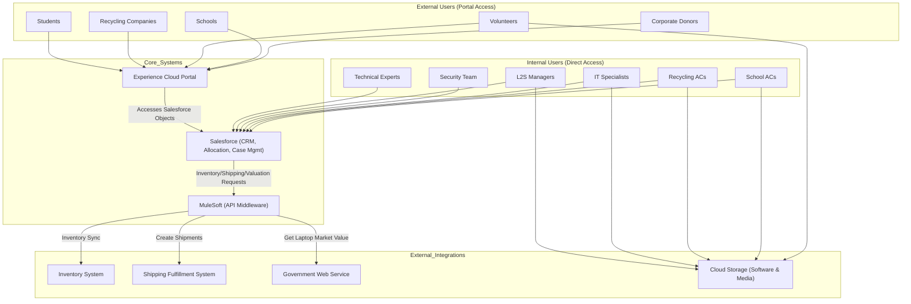

```mermaid
flowchart TD
  %% External Systems
  subgraph External_Integrations
    InventorySystem["Inventory System"]
    ShippingSystem["Shipping Fulfillment System"]
    GovWebService["Government Web Service"]
    CloudStorageSystem["Cloud Storage (Software & Media)"]
  end

  %% Core Platform
  subgraph Core_Systems
    ExperienceCloud["Experience Cloud Portal"]
    Salesforce["Salesforce (CRM, Allocation, Case Mgmt)"]
    MuleSoft["MuleSoft (API Middleware)"]
  end

  %% Users
  subgraph External_Users["External Users (Portal Access)"]
    Corporation["Corporate Donors"]
    SchoolUsers["Schools"]
    Volunteers["Volunteers"]
    RecyclingCompanies["Recycling Companies"]
    Students["Students"]
  end 

  subgraph Internal_Users["Internal Users (Direct Access)"]
    SchoolACs["School ACs"]
    RecyclingACs["Recycling ACs"]
    ITSpecialists["IT Specialists"]
    SecurityTeam["Security Team"]
    Managers["L2S Managers"]
    TechnicalExperts["Technical Experts"]
  end

  %% Access Patterns
  Corporation --> ExperienceCloud
  SchoolUsers --> ExperienceCloud
  Volunteers --> ExperienceCloud
  RecyclingCompanies --> ExperienceCloud
  Students --> ExperienceCloud

  Volunteers --> CloudStorageSystem
  SchoolACs --> CloudStorageSystem
  RecyclingACs --> CloudStorageSystem
  ITSpecialists --> CloudStorageSystem
  Managers --> CloudStorageSystem

  SchoolACs --> Salesforce
  RecyclingACs --> Salesforce
  ITSpecialists --> Salesforce
  SecurityTeam --> Salesforce
  Managers --> Salesforce
  TechnicalExperts --> Salesforce

  ExperienceCloud -->|Accesses Salesforce Objects| Salesforce

  %% Integration Orchestration
  Salesforce -->|Inventory/Shipping/Valuation Requests| MuleSoft
  MuleSoft -->|Inventory Sync| InventorySystem
  MuleSoft -->|Create Shipments| ShippingSystem
  MuleSoft -->|Get Laptop Market Value| GovWebService

```
