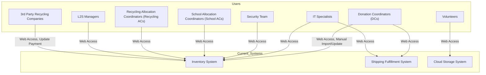

```mermaid
flowchart TD
    subgraph Current_Systems
        InventorySystem["Inventory System"]
        click InventorySystem "System of record for laptops, schools, and recycling companies" "System of record for laptops, schools, and recycling companies"
        ShippingSystem["Shipping Fulfillment System"]
        CloudStorage["Cloud Storage System"]
    end

    subgraph Users
        DCs["Donation Coordinators (DCs)"]
        ITSpecialists["IT Specialists"]
        SecurityTeam["Security Team"]
        SchoolACs["School Allocation Coordinators (School ACs)"]
        RecyclingACs["Recycling Allocation Coordinators (Recycling ACs)"]
        Managers["L2S Managers"]
        RecyclingCompanies["3rd Party Recycling Companies"]
        Volunteers
    end

    %% System Access
    DCs -- "Web Access, Manual Import/Update" --> InventorySystem
    DCs -- "Web Access" --> ShippingSystem
    ITSpecialists -- "Web Access" --> InventorySystem
    ITSpecialists -- "Web Access" --> ShippingSystem
    SecurityTeam -- "Web Access" --> InventorySystem
    SchoolACs -- "Web Access" --> InventorySystem
    RecyclingACs -- "Web Access" --> InventorySystem
    Managers -- "Web Access" --> InventorySystem
    RecyclingCompanies -- "Web Access, Update Payment" --> InventorySystem
    Volunteers --"Web Access" --> CloudStorage
```