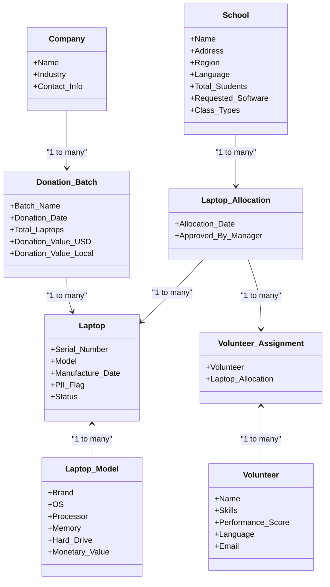

```mermaid
classDiagram
    class Company {
        +Name
        +Industry
        +Contact_Info
    }

    class Donation_Batch {
        +Batch_Name
        +Donation_Date
        +Total_Laptops
        +Donation_Value_USD
        +Donation_Value_Local
    }

    class Laptop {
        +Serial_Number
        +Model
        +Manufacture_Date
        +PII_Flag
        +Status
    }

    class Laptop_Model {
        +Brand
        +OS
        +Processor
        +Memory
        +Hard_Drive
        +Monetary_Value
    }
    class School {
        +Name
        +Address
        +Region
        +Language
        +Total_Students
        +Requested_Software
        +Class_Types
    }

    class Laptop_Allocation {
        +Allocation_Date
        +Approved_By_Manager
    }

    class Volunteer {
        +Name
        +Skills
        +Performance_Score
        +Language
        +Email
    }

        class Volunteer_Assignment {
        +Volunteer
        +Laptop_Allocation
    }

    %% Label cardinality text manually
    Company --> Donation_Batch : "1 to many"
    Donation_Batch --> Laptop : "1 to many"
    Laptop_Allocation --> Laptop : "1 to many"
    Laptop <-- Laptop_Model : "1 to many"
    School --> Laptop_Allocation : "1 to many"
    Laptop_Allocation --> Volunteer_Assignment : "1 to many"
    Volunteer_Assignment <-- Volunteer : "1 to many"
```