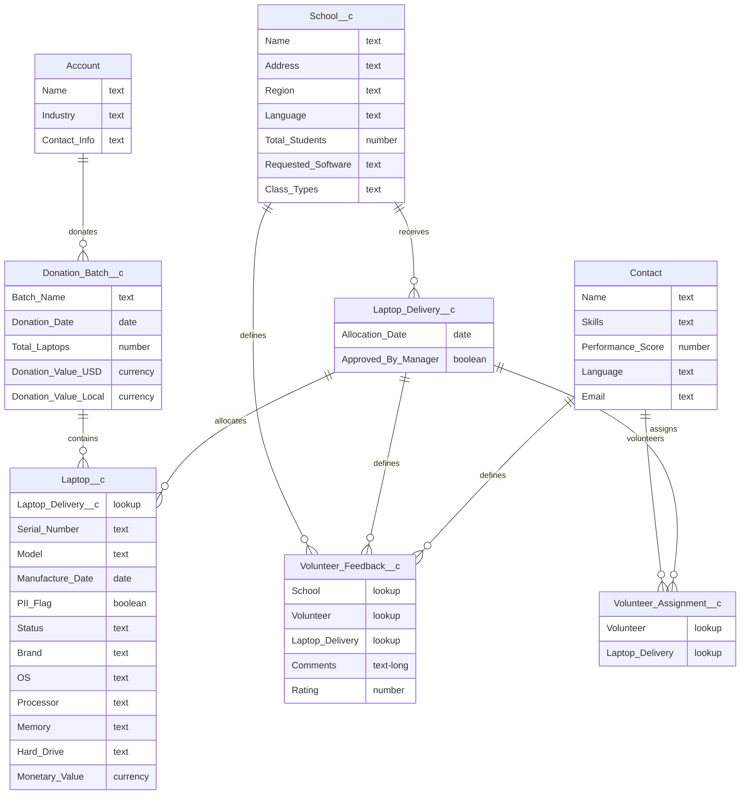

```mermaid
erDiagram
    Account {
        Name text
        Industry text
        Contact_Info text
    }
    Donation_Batch__c {
        Batch_Name text
        Donation_Date date
        Total_Laptops number
        Donation_Value_USD currency
        Donation_Value_Local currency
    }
    Laptop__c {
        Laptop_Delivery__c lookup
        Serial_Number text
        Model text
        Manufacture_Date date
        PII_Flag boolean
        Status text
        Brand text
        OS text
        Processor text
        Memory text
        Hard_Drive text
        Monetary_Value currency
    }
    School__c {
        Name text
        Address text
        Region text
        Language text
        Total_Students number
        Requested_Software text
        Class_Types text
    }
    Laptop_Delivery__c {
        Allocation_Date date
        Approved_By_Manager boolean
    }
    Contact {
        Name text
        Skills text
        Performance_Score number
        Language text
        Email text
    }
    Volunteer_Assignment__c {
        Volunteer lookup
        Laptop_Delivery lookup
    }
    Volunteer_Feedback__c {
    School lookup
    Volunteer lookup
    Laptop_Delivery lookup
    Comments text-long
    Rating number
    }
    Account ||--o{ Donation_Batch__c : donates
    Donation_Batch__c ||--o{ Laptop__c : contains
    School__c ||--o{ Volunteer_Feedback__c : defines
    Laptop_Delivery__c ||--o{ Volunteer_Feedback__c : defines
    School__c ||--o{ Laptop_Delivery__c : receives
    Contact ||--o{ Volunteer_Feedback__c : defines
    Laptop_Delivery__c ||--o{ Laptop__c : allocates
    Contact ||--o{ Volunteer_Assignment__c : volunteers
    Laptop_Delivery__c ||--o{ Volunteer_Assignment__c : assigns
```