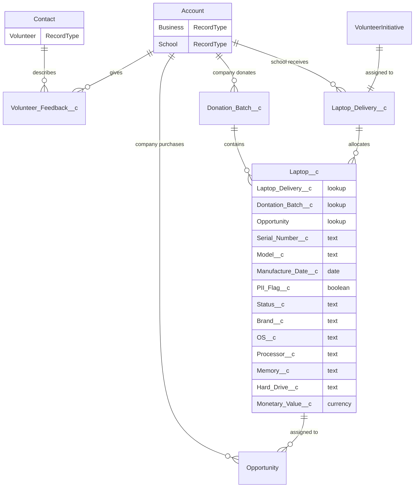

```mermaid
erDiagram
    Account {
        Business RecordType
        School RecordType
    }
    Contact{
        Volunteer RecordType
    }

    Volunteer_Feedback__c

    Opportunity{

    }
    Donation_Batch__c {

    }
    Laptop__c {
        Laptop_Delivery__c lookup
        Dontation_Batch__c lookup
        Opportunity lookup
        Serial_Number__c text
        Model__c text
        Manufacture_Date__c date
        PII_Flag__c boolean
        Status__c text
        Brand__c text
        OS__c text
        Processor__c text
        Memory__c text
        Hard_Drive__c text
        Monetary_Value__c currency
    }
    Laptop_Delivery__c {
    }

    VolunteerInitiative {
    }

    Account ||--o{ Donation_Batch__c : "company donates"
    Account ||--o{ Opportunity : "company purchases"
    Donation_Batch__c ||--o{ Laptop__c : contains
    Account ||--o{ Laptop_Delivery__c : "school receives"
    Laptop_Delivery__c ||--o{ Laptop__c : allocates
    VolunteerInitiative ||--|| Laptop_Delivery__c : "assigned to"
    Laptop__c ||--o{ Opportunity : "assigned to"
    Contact ||--o{ Volunteer_Feedback__c : "describes"
    Account ||--o{ Volunteer_Feedback__c : "gives"
```